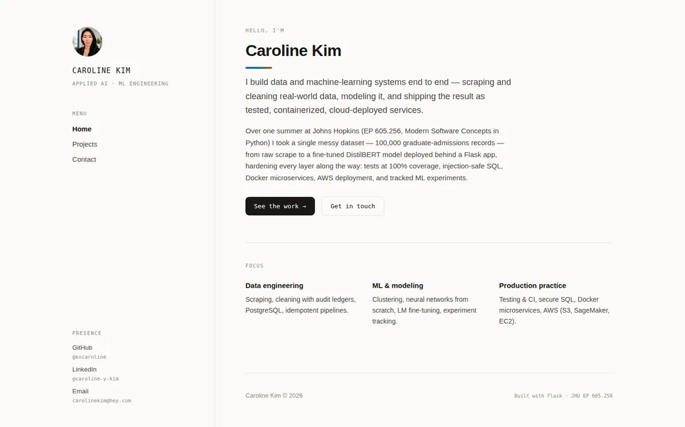

# Portfolio site

[](https://github.com/kxcaroline/portfolio/actions/workflows/ci.yml)

My personal site — a Flask application that renders its own project index
from JSON, so adding work is a data edit rather than a template change.

**Live:** [caroline.kim](https://caroline.kim) · **Demo it hosts:**
[Will You Get In?](https://huggingface.co/spaces/kxcaroline/will-you-get-in),
a DistilBERT admissions model embedded in the projects page



## What is worth reading

The site is small on purpose. These are the parts that took the thinking:

- **Content is data, not markup.** Every project block, case study, skill and
  statistic is loaded from `flask_website/data/*.json` and rendered through
  Python. `pages.py` holds the loaders, each of which degrades to an empty
  result rather than raising — a half-written data file drops one section
  instead of taking the page down.
- **Cache-busting derived from the filesystem.** Static URLs are stamped with
  the file's modification time (`asset()` in `__init__.py`). The hand-typed
  `?v=59` this replaced was wrong more often than right: editing a stylesheet
  without bumping the number shipped a correct deploy that nobody could see.
- **Images cost 157 KB, not 1.2 MB.** `build_thumbs.py` writes tile-sized
  WebP copies and records their dimensions in `data/thumb_sizes.json`, so the
  page reserves the right box without an image library in the deployed
  application. Full captures load only when the lightbox opens.
- **Tests cover the contract, not just the routes.** The suite asserts the
  shape the templates depend on — that declared image dimensions match the
  files, that every case study resolves, that loaders survive malformed
  input — and CI fails below 100% statement coverage.
- **Measured, not eyeballed.** Layout, contrast and payload were checked with
  headless-browser measurement and Lighthouse: 99-100 performance and 100
  accessibility, best practices and SEO. Muted text sits at 5.3:1 in both themes; the theme toggle's
  border clears the 3:1 required of interface boundaries.

## Run it

```bash
python -m venv .venv && source .venv/bin/activate
pip install -r requirements-dev.txt
python run.py                     # http://127.0.0.1:8080
pytest --cov=flask_website        # 100% statement coverage, enforced
```

## Checks

CI runs five jobs on every push (`.github/workflows/ci.yml`), and each can
be run locally first:

```bash
pylint flask_website run.py build_thumbs.py build_stats.py build_assets.py tests/test_site.py --fail-under=10
mypy flask_website run.py build_thumbs.py build_stats.py build_assets.py tests
npx pyright                       # pinned in CI to the version tested here
pytest --cov=flask_website --cov-fail-under=100
pre-commit run --all-files        # after: pip install pre-commit && pre-commit install
```

The boot job additionally serves the site under gunicorn — the production
entry point — and probes every route, which catches factory and config
mistakes the test client imports around. Dependency scans (pip-audit, and
Snyk when a token is configured) are report-only. Renovate keeps
dependencies and pinned action digests current with a weekly batched PR.

The commit convention lives in `.gitmessage`; point git at it once with
`git config commit.template .gitmessage`.

## Layout

```
run.py                  entry point; creates the app
flask_website/
  __init__.py           application factory, gzip, asset stamping
  config.py             configuration object
  pages/pages.py        routes, JSON loaders, chart projection
  templates/            base + one template per page, plus partials
  static/               stylesheet, one JS file, images, fonts, demos
  data/                 projects, stats, skills, thumbnail sizes
tests/test_site.py      the suite
build_thumbs.py         regenerates thumbnails after adding a screenshot
build_stats.py          recomputes the homepage figures from the dataset
build_assets.py         writes the minified stylesheet and script
excerpts/               selected files from projects whose repos stay private
```

## Adding a project

Append an entry to `flask_website/data/projects.json`, drop its screenshots
in `static/images/projects/<name>/`, and run `python build_thumbs.py`. A
`case` key gives the project its own case-study page; a `live` key adds a
link to a deployed demo; a `source` key links a public repository.

Entries carry a `kind` — `project` for original work, `coursework` for the
course modules (the default). Original work renders first, under its own
heading. Full field reference: [docs/adding-a-project.md](docs/adding-a-project.md).

## Notes

`build_stats.py` reads a cleaned dataset that is not in this repository —
the numbers it produces are committed as `data/site_stats.json`, and the
script is here to show where they came from.

Several projects listed on the site are university coursework whose
repositories stay private, so current students are not handed solutions.
Those entries carry case studies with selected excerpts instead.

## License

MIT — see [LICENSE](LICENSE). The written content and images are mine;
the code is free to reuse.
